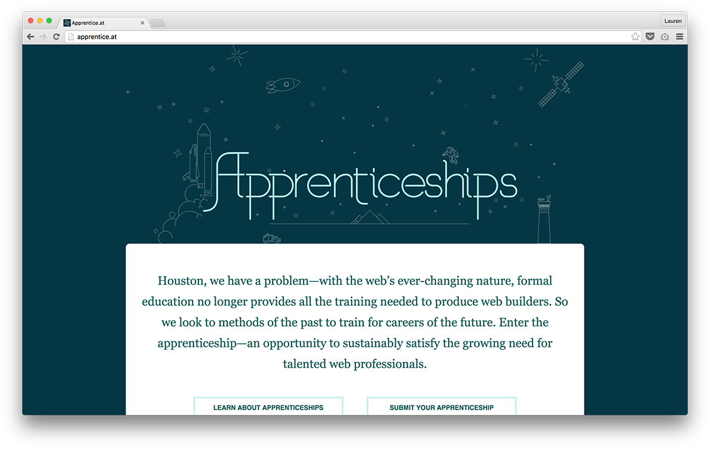

Apprentice.at is a place where aspiring designers and developers can find appenticeships and a place where companies can submit apprenticeships to be found.

Our goal was to provide potential apprentices a way to find and access opportunities easily. Our plan was to provide a central location to learn about companies, their programs, and how to apply. As a secondary goal, we wanted to provide information about what apprenticeships are and why they’re beneficial to both parties.

Not only was this a project where the apprentices at <a href="http://seesparkbox.com" alt="Sparkbox">Sparkbox</a> got to work together, but we also worked with several other members of the Sparkbox team. They were there to lend a hand through the process of building all aspects of the website.

Learn more about the project <a href="https://seesparkbox.com/foundry/the_making_of_apprentice.at" alt="The Making of Apprentice.at">here</a> or visit below.

<a href="http://apprentice.at" alt="Apprentice.at" class="btn btn--default">Visit Apprentice.at &#8594;</a>