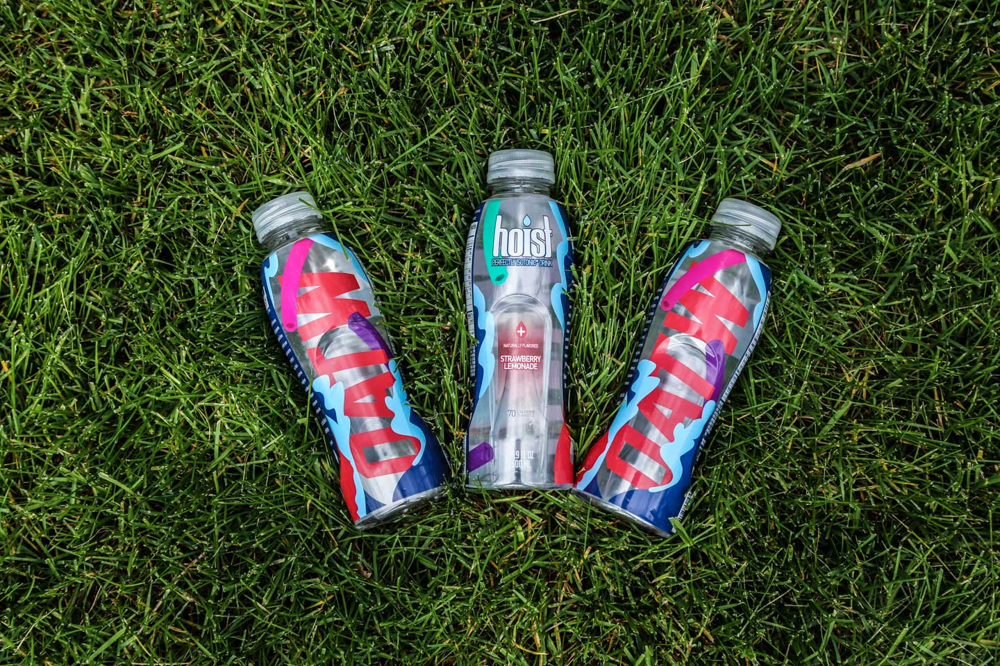

## What was your approach for designing this?

I honestly just wanted to have fun with it. I wanted it to be playful and bright. Something that could be displayed as art. It started with a sketch of wave forms and it transformed into something that feels nostalgic. It reminds me of summer as a kid. Remember Super Soakers? A Super Soaker 2000 is like $100-$150 on eBay. That’s insane to me.

Excerpt from an interview with <a href="http://ohio-streets.com/2015/07/09/meet-the-designer-behind-hoist-and-oatws-collaboration-lauren-dorman-2/" alt="Lauren Dorman's Interview with Ohio Streets">Ohio Streets</a>. 

<a href="http://ohio-streets.com/2015/07/09/meet-the-designer-behind-hoist-and-oatws-collaboration-lauren-dorman-2/" alt="Lauren Dorman's Interview with Ohio Streets" class="btn btn--default">Read it in full &#8594;</a>